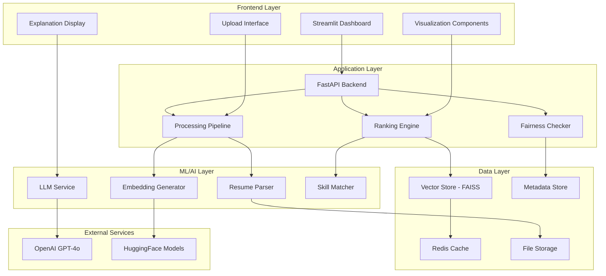
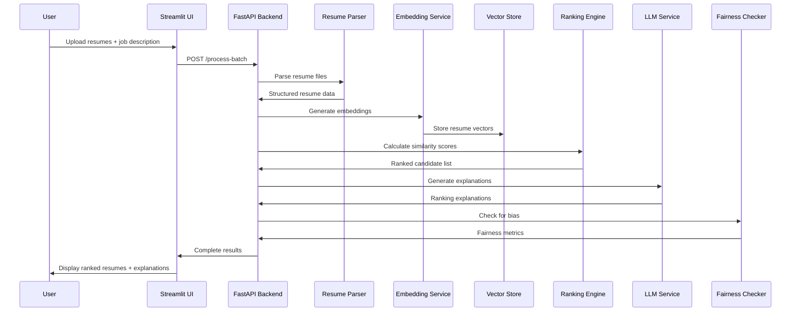

# Design Document: AI-Powered Resume Screening and Ranking System

## Overview

The AI-powered resume screening and ranking system is a comprehensive solution that automates the initial stages of recruitment by intelligently parsing, analyzing, and ranking resumes against job requirements. The system combines traditional keyword matching with modern semantic understanding using transformer-based embeddings, providing recruiters with ranked candidate lists, detailed explanations, and bias-aware recommendations. Built as a Streamlit web application with a modular Python backend, the system supports PDF/DOCX resume parsing, vector-based similarity search, LLM-powered explanations, and includes fairness checks to mitigate hiring bias.

The system follows a hybrid scoring approach that balances semantic similarity (using sentence transformers) with explicit skill matching, providing both automated rankings and human-interpretable explanations. The MVP targets a 48-72 hour development timeline with containerized deployment and CI/CD integration for production readiness.

## Architecture



## Main Algorithm/Workflow



## Components and Interfaces

### Component 1: Resume Parser

**Purpose**: Extracts structured data from PDF/DOCX resume files including personal info, skills, experience, and education.

**Interface**:
```python
class ResumeParser:
    def parse_resume(self, file_path: str) -> ResumeData:
        """Parse a single resume file and extract structured data"""
        pass
    
    def batch_parse(self, file_paths: List[str]) -> List[ResumeData]:
        """Parse multiple resume files in batch"""
        pass
    
    def extract_text(self, file_path: str) -> str:
        """Extract raw text from resume file"""
        pass
    
    def extract_sections(self, text: str) -> Dict[str, str]:
        """Identify and extract resume sections"""
        pass
```

**Responsibilities**:
- PDF/DOCX text extraction using PyMuPDF/pdfplumber
- Section identification (experience, education, skills, contact)
- Named entity recognition for skills and companies
- Data validation and cleaning

### Component 2: Embedding Generator

**Purpose**: Converts resume text and job descriptions into semantic vector representations for similarity matching.

**Interface**:
```python
class EmbeddingGenerator:
    def __init__(self, model_name: str = "all-MiniLM-L6-v2"):
        """Initialize with specified sentence transformer model"""
        pass
    
    def encode_resume(self, resume_data: ResumeData) -> np.ndarray:
        """Generate embedding vector for resume"""
        pass
    
    def encode_job_description(self, job_desc: str) -> np.ndarray:
        """Generate embedding vector for job description"""
        pass
    
    def batch_encode(self, texts: List[str]) -> np.ndarray:
        """Generate embeddings for multiple texts efficiently"""
        pass
```

**Responsibilities**:
- Load and manage sentence transformer models
- Generate 384-dimensional embeddings (MiniLM) or 768-dimensional (MPNet)
- Batch processing for efficiency
- Caching of computed embeddings

### Component 3: Vector Store Manager

**Purpose**: Manages storage and retrieval of resume embeddings using FAISS for similarity search.

**Interface**:
```python
class VectorStoreManager:
    def __init__(self, dimension: int = 384):
        """Initialize FAISS index with specified dimension"""
        pass
    
    def add_embeddings(self, embeddings: np.ndarray, metadata: List[Dict]) -> None:
        """Add resume embeddings to the index"""
        pass
    
    def search_similar(self, query_embedding: np.ndarray, k: int = 10) -> List[Tuple[int, float]]:
        """Find k most similar resumes to query"""
        pass
    
    def save_index(self, path: str) -> None:
        """Persist index to disk"""
        pass
    
    def load_index(self, path: str) -> None:
        """Load index from disk"""
        pass
```

**Responsibilities**:
- FAISS index management (IndexFlatIP for cosine similarity)
- Efficient similarity search with configurable k
- Index persistence and loading
- Metadata association with vectors

### Component 4: Ranking Engine

**Purpose**: Combines semantic similarity with skill matching to produce final candidate rankings.

**Interface**:
```python
class RankingEngine:
    def __init__(self, semantic_weight: float = 0.7, skill_weight: float = 0.3):
        """Initialize with configurable scoring weights"""
        pass
    
    def calculate_hybrid_score(self, resume: ResumeData, job_desc: JobDescription) -> float:
        """Calculate combined semantic + skill matching score"""
        pass
    
    def rank_candidates(self, resumes: List[ResumeData], job_desc: JobDescription) -> List[RankedCandidate]:
        """Rank all candidates against job requirements"""
        pass
    
    def explain_ranking(self, candidate: RankedCandidate, job_desc: JobDescription) -> str:
        """Generate human-readable ranking explanation"""
        pass
```

**Responsibilities**:
- Hybrid scoring algorithm implementation
- Skill overlap calculation using Jaccard similarity
- Configurable weight balancing
- Ranking explanation generation

### Component 5: LLM Service

**Purpose**: Provides AI-powered explanations and re-ranking capabilities using GPT-4o or local models.

**Interface**:
```python
class LLMService:
    def __init__(self, model: str = "gpt-4o", api_key: str = None):
        """Initialize with specified LLM model"""
        pass
    
    def generate_explanation(self, resume: ResumeData, job_desc: JobDescription, score: float) -> str:
        """Generate detailed explanation for candidate ranking"""
        pass
    
    def rerank_candidates(self, candidates: List[RankedCandidate], job_desc: JobDescription) -> List[RankedCandidate]:
        """Use LLM to refine candidate rankings"""
        pass
    
    def extract_key_requirements(self, job_desc: str) -> List[str]:
        """Extract key requirements from job description"""
        pass
```

**Responsibilities**:
- OpenAI API integration for GPT-4o
- Local model support (Llama3 via Ollama)
- Prompt engineering for ranking explanations
- Token usage optimization

### Component 6: Fairness Checker

**Purpose**: Monitors and reports potential bias in ranking results to ensure fair hiring practices.

**Interface**:
```python
class FairnessChecker:
    def check_demographic_parity(self, rankings: List[RankedCandidate]) -> Dict[str, float]:
        """Check for demographic parity in top-k candidates"""
        pass
    
    def four_fifths_rule(self, rankings: List[RankedCandidate], protected_attr: str) -> bool:
        """Apply four-fifths rule for bias detection"""
        pass
    
    def generate_fairness_report(self, rankings: List[RankedCandidate]) -> FairnessReport:
        """Generate comprehensive fairness analysis"""
        pass
    
    def suggest_adjustments(self, rankings: List[RankedCandidate]) -> List[str]:
        """Suggest ranking adjustments to improve fairness"""
        pass
```

**Responsibilities**:
- Demographic parity analysis
- Four-fifths rule implementation
- Bias detection and reporting
- Fairness metric calculation

## Data Models

### Model 1: ResumeData

```python
@dataclass
class ResumeData:
    candidate_id: str
    file_name: str
    raw_text: str
    contact_info: ContactInfo
    skills: List[str]
    experience: List[Experience]
    education: List[Education]
    embedding: Optional[np.ndarray] = None
    parsed_at: datetime = field(default_factory=datetime.now)
```

**Validation Rules**:
- candidate_id must be unique UUID
- skills list must contain at least 1 skill
- experience list can be empty for entry-level candidates

### Model 2: JobDescription

```python
@dataclass
class JobDescription:
    job_id: str
    title: str
    description: str
    required_skills: List[str]
    preferred_skills: List[str]
    experience_level: str
    embedding: Optional[np.ndarray] = None
    created_at: datetime = field(default_factory=datetime.now)
```

**Validation Rules**:
- required_skills must not be empty
- experience_level must be one of: entry, mid, senior, executive

### Model 3: RankedCandidate

```python
@dataclass
class RankedCandidate:
    resume: ResumeData
    semantic_score: float
    skill_score: float
    hybrid_score: float
    rank: int
    explanation: Optional[str] = None
    fairness_flags: List[str] = field(default_factory=list)
```

**Validation Rules**:
- All scores must be between 0.0 and 1.0
- rank must be positive integer
- hybrid_score should be weighted combination of semantic and skill scores

## Algorithmic Pseudocode

### Main Processing Algorithm

```pascal
ALGORITHM processResumeScreening(resumeFiles, jobDescription)
INPUT: resumeFiles of type List[File], jobDescription of type String
OUTPUT: rankedCandidates of type List[RankedCandidate]

BEGIN
  ASSERT resumeFiles.length > 0 AND jobDescription.length > 0
  
  // Step 1: Parse all resume files
  parsedResumes ← []
  FOR each file IN resumeFiles DO
    ASSERT file.isValid() AND file.extension IN ["pdf", "docx"]
    
    resumeData ← parseResume(file)
    parsedResumes.add(resumeData)
  END FOR
  
  // Step 2: Generate embeddings for resumes and job description
  jobEmbedding ← generateEmbedding(jobDescription)
  
  FOR each resume IN parsedResumes DO
    resume.embedding ← generateEmbedding(resume.combinedText())
  END FOR
  
  // Step 3: Calculate hybrid scores and rank candidates
  candidates ← []
  FOR each resume IN parsedResumes DO
    semanticScore ← cosineSimilarity(resume.embedding, jobEmbedding)
    skillScore ← calculateSkillOverlap(resume.skills, extractSkills(jobDescription))
    hybridScore ← (0.7 * semanticScore) + (0.3 * skillScore)
    
    candidate ← RankedCandidate(resume, semanticScore, skillScore, hybridScore)
    candidates.add(candidate)
  END FOR
  
  // Step 4: Sort by hybrid score and assign ranks
  candidates.sortByScore(descending=true)
  FOR i ← 0 TO candidates.length - 1 DO
    candidates[i].rank ← i + 1
  END FOR
  
  // Step 5: Generate explanations and check fairness
  FOR each candidate IN candidates DO
    candidate.explanation ← generateExplanation(candidate, jobDescription)
    candidate.fairness_flags ← checkFairness(candidate)
  END FOR
  
  ASSERT allCandidatesRanked(candidates) AND allScoresValid(candidates)
  
  RETURN candidates
END
```

**Preconditions:**
- resumeFiles contains valid PDF/DOCX files
- jobDescription is non-empty string with clear requirements
- All required ML models are loaded and available

**Postconditions:**
- All candidates have valid scores between 0.0 and 1.0
- Candidates are sorted by hybrid score in descending order
- Each candidate has unique rank starting from 1
- Fairness checks have been performed

**Loop Invariants:**
- All processed resumes have valid embeddings
- All calculated scores are within valid range [0.0, 1.0]
- Ranking order is maintained throughout processing

### Hybrid Scoring Algorithm

```pascal
ALGORITHM calculateHybridScore(resume, jobDescription, semanticWeight, skillWeight)
INPUT: resume of type ResumeData, jobDescription of type JobDescription, 
       semanticWeight of type Float, skillWeight of type Float
OUTPUT: hybridScore of type Float

BEGIN
  ASSERT semanticWeight + skillWeight = 1.0
  ASSERT resume.embedding IS NOT NULL AND jobDescription.embedding IS NOT NULL
  
  // Calculate semantic similarity using cosine similarity
  semanticScore ← cosineSimilarity(resume.embedding, jobDescription.embedding)
  
  // Calculate skill overlap using Jaccard similarity
  resumeSkills ← Set(resume.skills)
  requiredSkills ← Set(jobDescription.required_skills)
  preferredSkills ← Set(jobDescription.preferred_skills)
  
  // Weight required skills higher than preferred skills
  allJobSkills ← requiredSkills ∪ preferredSkills
  skillIntersection ← resumeSkills ∩ allJobSkills
  skillUnion ← resumeSkills ∪ allJobSkills
  
  // Bonus for required skills
  requiredMatches ← resumeSkills ∩ requiredSkills
  requiredBonus ← requiredMatches.size() / requiredSkills.size()
  
  baseSkillScore ← skillIntersection.size() / skillUnion.size()
  skillScore ← MIN(1.0, baseSkillScore + (0.2 * requiredBonus))
  
  // Combine scores with weights
  hybridScore ← (semanticWeight * semanticScore) + (skillWeight * skillScore)
  
  ASSERT hybridScore >= 0.0 AND hybridScore <= 1.0
  
  RETURN hybridScore
END
```

**Preconditions:**
- resume and jobDescription have valid embeddings
- semanticWeight and skillWeight sum to 1.0
- All skill lists are properly formatted

**Postconditions:**
- hybridScore is between 0.0 and 1.0
- Score reflects both semantic similarity and skill matching
- Required skills receive higher weight than preferred skills

**Loop Invariants:**
- Set operations maintain data integrity
- Score calculations remain within valid bounds

### Fairness Checking Algorithm

```pascal
ALGORITHM checkDemographicParity(rankedCandidates, topK)
INPUT: rankedCandidates of type List[RankedCandidate], topK of type Integer
OUTPUT: fairnessMetrics of type Dict[String, Float]

BEGIN
  ASSERT rankedCandidates.length >= topK AND topK > 0
  
  topCandidates ← rankedCandidates[0:topK]
  allCandidates ← rankedCandidates
  
  fairnessMetrics ← {}
  
  // Check gender parity
  topFemaleCount ← COUNT(c IN topCandidates WHERE c.resume.gender = "female")
  totalFemaleCount ← COUNT(c IN allCandidates WHERE c.resume.gender = "female")
  
  IF totalFemaleCount > 0 THEN
    topFemaleRate ← topFemaleCount / topK
    totalFemaleRate ← totalFemaleCount / allCandidates.length
    genderParity ← topFemaleRate / totalFemaleRate
    fairnessMetrics["gender_parity"] ← genderParity
    
    // Four-fifths rule check
    IF genderParity < 0.8 THEN
      fairnessMetrics["gender_bias_flag"] ← true
    END IF
  END IF
  
  // Check ethnicity parity (similar logic)
  FOR each ethnicity IN ["asian", "black", "hispanic", "white", "other"] DO
    topEthnicityCount ← COUNT(c IN topCandidates WHERE c.resume.ethnicity = ethnicity)
    totalEthnicityCount ← COUNT(c IN allCandidates WHERE c.resume.ethnicity = ethnicity)
    
    IF totalEthnicityCount > 0 THEN
      ethnicityParity ← (topEthnicityCount / topK) / (totalEthnicityCount / allCandidates.length)
      fairnessMetrics[ethnicity + "_parity"] ← ethnicityParity
      
      IF ethnicityParity < 0.8 THEN
        fairnessMetrics[ethnicity + "_bias_flag"] ← true
      END IF
    END IF
  END FOR
  
  ASSERT allParityScoresValid(fairnessMetrics)
  
  RETURN fairnessMetrics
END
```

**Preconditions:**
- rankedCandidates is sorted by score in descending order
- topK is positive and not greater than total candidates
- Demographic data is available for analysis

**Postconditions:**
- All parity scores are calculated correctly
- Bias flags are set according to four-fifths rule
- Fairness metrics cover all protected attributes

**Loop Invariants:**
- Parity calculations maintain mathematical consistency
- Bias flags are set only when thresholds are violated

## Key Functions with Formal Specifications

### Function 1: parseResume()

```python
def parseResume(file_path: str) -> ResumeData:
    """Parse a resume file and extract structured data"""
```

**Preconditions:**
- `file_path` points to valid PDF or DOCX file
- File is readable and not corrupted
- File size is under 10MB limit

**Postconditions:**
- Returns ResumeData object with all required fields populated
- If parsing fails, raises ParseError with descriptive message
- Extracted skills list contains at least 1 skill or empty list for valid resumes
- Contact information is properly validated

**Loop Invariants:** N/A (no loops in main function)

### Function 2: generateEmbedding()

```python
def generateEmbedding(text: str) -> np.ndarray:
    """Generate semantic embedding vector for input text"""
```

**Preconditions:**
- `text` is non-empty string
- Text length is under model's maximum token limit (512 tokens for MiniLM)
- Sentence transformer model is loaded and ready

**Postconditions:**
- Returns numpy array with shape (384,) for MiniLM or (768,) for MPNet
- All embedding values are finite (no NaN or infinity)
- Embedding is L2-normalized for cosine similarity

**Loop Invariants:** N/A (handled internally by transformer model)

### Function 3: cosineSimilarity()

```python
def cosineSimilarity(vec1: np.ndarray, vec2: np.ndarray) -> float:
    """Calculate cosine similarity between two embedding vectors"""
```

**Preconditions:**
- `vec1` and `vec2` have same dimensionality
- Both vectors are L2-normalized
- No NaN or infinity values in vectors

**Postconditions:**
- Returns float value between -1.0 and 1.0
- For normalized vectors, result is between 0.0 and 1.0
- Identical vectors return 1.0, orthogonal vectors return 0.0

**Loop Invariants:** N/A (vectorized operation)

## Example Usage

```python
# Example 1: Basic resume screening workflow
from ai_resume_screener import ResumeScreener

screener = ResumeScreener(
    embedding_model="all-MiniLM-L6-v2",
    semantic_weight=0.7,
    skill_weight=0.3
)

# Process batch of resumes
resume_files = ["resume1.pdf", "resume2.pdf", "resume3.docx"]
job_description = """
Software Engineer position requiring Python, machine learning experience,
and 3+ years of backend development. Preferred skills include Docker, AWS, and FastAPI.
"""

ranked_candidates = screener.process_batch(resume_files, job_description)

# Display results
for candidate in ranked_candidates[:5]:  # Top 5 candidates
    print(f"Rank {candidate.rank}: {candidate.resume.contact_info.name}")
    print(f"Score: {candidate.hybrid_score:.3f}")
    print(f"Explanation: {candidate.explanation}")
    print("---")

# Example 2: Fairness analysis
fairness_report = screener.check_fairness(ranked_candidates)
if fairness_report.has_bias_flags():
    print("Potential bias detected:")
    for flag in fairness_report.bias_flags:
        print(f"- {flag}")

# Example 3: Custom scoring weights
custom_screener = ResumeScreener(
    semantic_weight=0.5,  # Equal weight to semantic and skill matching
    skill_weight=0.5,
    llm_model="gpt-4o"
)

# Re-rank with LLM explanations
enhanced_rankings = custom_screener.llm_rerank(ranked_candidates, job_description)
```

## Correctness Properties

The system maintains the following correctness properties expressed as universal quantifications:

**Property 1: Score Validity**
```
∀ candidate ∈ rankedCandidates:
  0.0 ≤ candidate.semantic_score ≤ 1.0 ∧
  0.0 ≤ candidate.skill_score ≤ 1.0 ∧
  0.0 ≤ candidate.hybrid_score ≤ 1.0
```

**Property 2: Ranking Consistency**
```
∀ i, j ∈ [1, n] where i < j:
  rankedCandidates[i].hybrid_score ≥ rankedCandidates[j].hybrid_score ∧
  rankedCandidates[i].rank < rankedCandidates[j].rank
```

**Property 3: Embedding Dimensionality**
```
∀ resume ∈ parsedResumes:
  resume.embedding.shape = (embedding_dimension,) ∧
  ¬∃ x ∈ resume.embedding: isNaN(x) ∨ isInfinite(x)
```

**Property 4: Skill Matching Accuracy**
```
∀ candidate ∈ rankedCandidates:
  candidate.skill_score = |candidate.resume.skills ∩ job.required_skills| / 
                         |candidate.resume.skills ∪ job.required_skills|
```

**Property 5: Fairness Constraint**
```
∀ protected_group ∈ protectedGroups:
  let selection_rate_group = |topK ∩ protected_group| / |protected_group|
  let selection_rate_total = |topK| / |allCandidates|
  selection_rate_group / selection_rate_total ≥ 0.8  // Four-fifths rule
```

## Error Handling

### Error Scenario 1: Resume Parsing Failure

**Condition**: PDF/DOCX file is corrupted, password-protected, or unsupported format
**Response**: Log error details, skip file, continue processing remaining resumes
**Recovery**: Return partial results with error report indicating failed files

### Error Scenario 2: Embedding Model Loading Failure

**Condition**: Sentence transformer model fails to load due to network issues or insufficient memory
**Response**: Attempt fallback to smaller model (MiniLM), if that fails, use TF-IDF vectorization
**Recovery**: Graceful degradation with warning about reduced semantic understanding

### Error Scenario 3: LLM API Rate Limiting

**Condition**: OpenAI API returns rate limit error during explanation generation
**Response**: Implement exponential backoff retry strategy, queue requests
**Recovery**: Generate basic template explanations if API remains unavailable

### Error Scenario 4: Vector Store Index Corruption

**Condition**: FAISS index file is corrupted or incompatible version
**Response**: Rebuild index from scratch using cached embeddings
**Recovery**: If no cached embeddings, regenerate from parsed resume data

### Error Scenario 5: Fairness Check Data Insufficient

**Condition**: Demographic data missing or insufficient for statistical analysis
**Response**: Skip fairness analysis, display warning about incomplete bias checking
**Recovery**: Provide general fairness guidelines and manual review recommendations

## Testing Strategy

### Unit Testing Approach

**Framework**: pytest with coverage reporting
**Key Test Categories**:
- Resume parsing accuracy with sample PDF/DOCX files
- Embedding generation consistency and dimensionality
- Scoring algorithm correctness with known inputs/outputs
- Fairness metric calculations with synthetic demographic data
- Error handling for various failure scenarios

**Coverage Goals**: 90% code coverage with focus on critical paths

**Property Test Library**: Hypothesis for Python

### Property-Based Testing Approach

**Property Tests**:
1. **Score Monotonicity**: Higher similarity should never result in lower hybrid scores
2. **Ranking Transitivity**: If candidate A ranks higher than B, and B higher than C, then A ranks higher than C
3. **Embedding Stability**: Same resume text should always produce identical embeddings
4. **Skill Matching Commutativity**: Skill overlap calculation should be symmetric
5. **Fairness Invariants**: Demographic parity calculations should remain consistent across different orderings

**Test Data Generation**:
- Generate synthetic resumes with controlled skill sets
- Create job descriptions with varying requirement complexity
- Produce demographic data with known bias patterns

### Integration Testing Approach

**End-to-End Workflows**:
- Complete resume screening pipeline from file upload to ranked results
- Streamlit UI interaction testing with Selenium
- API endpoint testing with realistic payloads
- Database persistence and retrieval operations

**Performance Testing**:
- Batch processing scalability (100+ resumes)
- Memory usage profiling during embedding generation
- Response time benchmarks for different model sizes

## Performance Considerations

**Embedding Generation Optimization**:
- Batch processing for multiple resumes to leverage GPU parallelization
- Caching of computed embeddings to avoid recomputation
- Model quantization for faster inference (INT8 precision)

**Vector Search Efficiency**:
- FAISS IndexFlatIP for exact cosine similarity search
- Consider IndexIVFFlat for approximate search with large datasets (>10k resumes)
- Memory mapping for large indices to reduce RAM usage

**Scalability Targets**:
- MVP: Handle 100 resumes in under 2 minutes
- Production: Process 1000+ resumes with sub-second search response
- Memory: Stay under 4GB RAM usage for containerized deployment

**Caching Strategy**:
- Redis for embedding cache with TTL-based expiration
- File-based caching for parsed resume data
- Model weight caching to avoid repeated downloads

## Security Considerations

**Data Privacy**:
- Resume data encryption at rest using AES-256
- Secure file upload with virus scanning
- Automatic data retention policies (30-day default)
- GDPR compliance for candidate data handling

**API Security**:
- JWT-based authentication for API endpoints
- Rate limiting to prevent abuse (100 requests/hour per user)
- Input validation and sanitization for all user inputs
- HTTPS enforcement for all communications

**Model Security**:
- Secure storage of API keys using environment variables
- Model weight integrity verification
- Sandboxed execution environment for LLM interactions

**Audit Trail**:
- Comprehensive logging of all screening decisions
- Bias detection alerts and reporting
- User action tracking for compliance purposes

## Dependencies

**Core ML/AI Libraries**:
- sentence-transformers==2.2.2 (semantic embeddings)
- faiss-cpu==1.7.4 (vector similarity search)
- spacy==3.6.1 (NLP preprocessing)
- openai==1.3.0 (LLM integration)
- transformers==4.35.0 (model loading)

**Document Processing**:
- PyMuPDF==1.23.0 (PDF text extraction)
- python-docx==0.8.11 (DOCX processing)
- pdfplumber==0.9.0 (alternative PDF parser)

**Web Framework & UI**:
- streamlit==1.28.0 (web interface)
- fastapi==0.104.0 (API backend)
- uvicorn==0.24.0 (ASGI server)

**Data & Storage**:
- pandas==2.1.0 (data manipulation)
- numpy==1.24.3 (numerical operations)
- redis==5.0.0 (caching layer)

**Development & Testing**:
- pytest==7.4.0 (testing framework)
- hypothesis==6.88.0 (property-based testing)
- black==23.9.0 (code formatting)
- mypy==1.6.0 (type checking)

**Deployment**:
- docker==6.1.0 (containerization)
- gunicorn==21.2.0 (production WSGI server)
- nginx (reverse proxy and static files)

**External Services**:
- OpenAI GPT-4o API (explanations and re-ranking)
- HuggingFace Model Hub (sentence transformer models)
- Optional: Pinecone or Qdrant for production vector storage