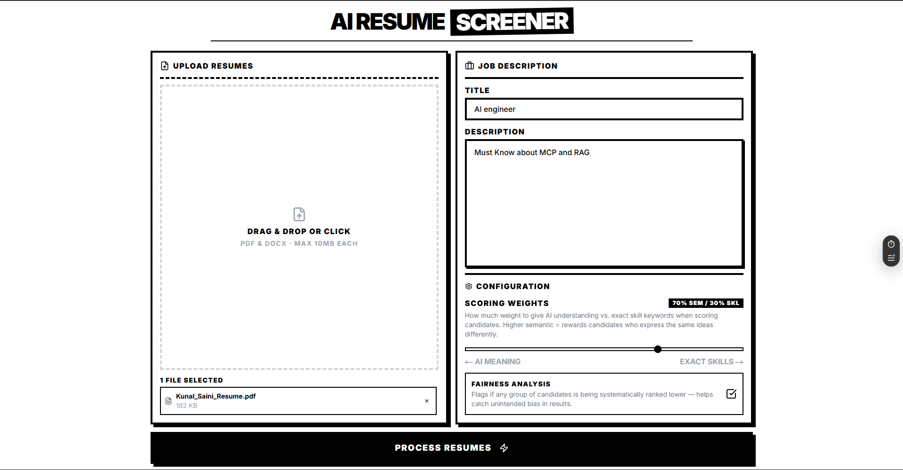
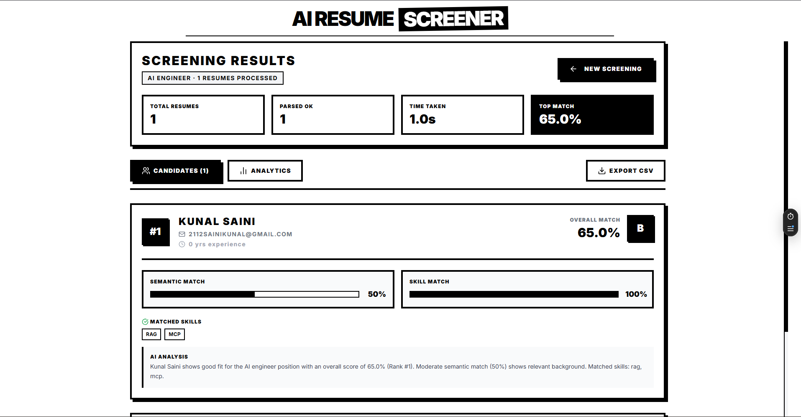
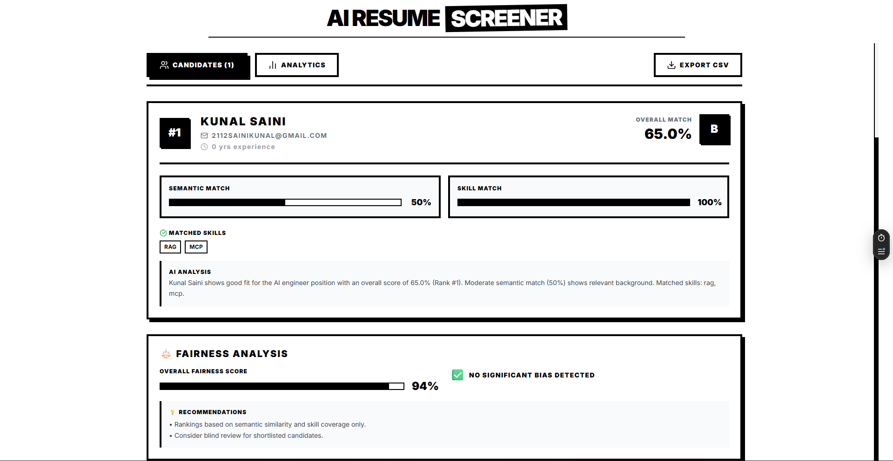
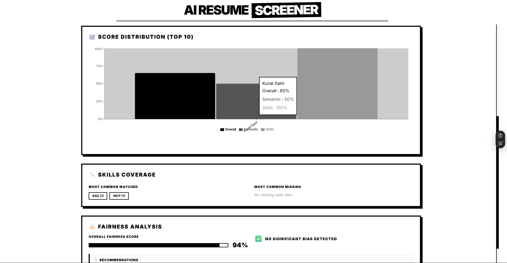

# AI Resume Screener

**Live Demo → https://ai-resume-screener-sepia.vercel.app**

> Upload resumes, paste a job description, get ranked candidates with AI scores, skill analysis, and explanations in seconds.

---

## What This Project Does

Most resume screening is keyword matching — a candidate who writes "document similarity pipeline" instead of "FAISS" gets buried even if they are the best fit. This system solves that by combining **semantic understanding** (what the resume *means*) with **skill coverage** (what keywords it *contains*) into a single hybrid score.

```
Resume PDF/DOCX
      │
      ▼
┌─────────────────────────────────────────────────────────┐
│                   SCORING PIPELINE                       │
│                                                         │
│  Text Extraction → Skill Extraction → Embedding → Score │
│       (PyMuPDF)       (Regex+IDF)    (HF API)  (Hybrid) │
└─────────────────────────────────────────────────────────┘
      │
      ▼
Ranked candidates with scores, explanations, fairness report
```

---

## Architecture

```
┌──────────────────────────────────────────────────────────────────┐
│                        BROWSER (Client)                          │
│                                                                  │
│   React 19 + Next.js 15 + Zustand + Recharts + Framer Motion    │
│                                                                  │
│   User uploads PDFs/DOCX + pastes Job Description               │
│   → POST /api/screen  (same-origin, no CORS)                    │
└──────────────────────┬───────────────────────────────────────────┘
                       │
                       ▼
┌──────────────────────────────────────────────────────────────────┐
│              VERCEL SERVERLESS FUNCTION                          │
│              app/api/screen/route.ts                             │
│                                                                  │
│   Acts as a server-side proxy — browser never touches Render     │
│   directly (solves CORS for multipart/form-data)                 │
│                                                                  │
│   Primary:  → forwards to Render ML backend                      │
│   Fallback: → runs TF-IDF engine locally if Render is down       │
│                                                                  │
│   maxDuration: 300s  (covers Render cold start + ML inference)   │
└──────────────────────┬───────────────────────────────────────────┘
                       │  HTTP POST (server-to-server, no CORS)
                       ▼
┌──────────────────────────────────────────────────────────────────┐
│              RENDER ML BACKEND (Docker)                          │
│              FastAPI + Python 3.11                               │
│                                                                  │
│   1. PyMuPDF  → extract text from PDF bytes                      │
│   2. Regex taxonomy → extract skills from text                   │
│   3. HuggingFace Inference API → get 384-dim embeddings          │
│      model: sentence-transformers/all-MiniLM-L6-v2              │
│   4. NumPy cosine similarity → semantic score                    │
│   5. IDF-weighted skill overlap → skill score                    │
│   6. Hybrid formula → final ranking                              │
│                                                                  │
└──────────────────────┬───────────────────────────────────────────┘
                       │  HTTPS API call
                       ▼
┌──────────────────────────────────────────────────────────────────┐
│         HUGGINGFACE INFERENCE API (External)                     │
│         sentence-transformers/all-MiniLM-L6-v2                  │
│                                                                  │
│   Input:  text string (resume or JD, max 2000 chars)            │
│   Output: 384-dimensional float vector                           │
│   Method: mean pooling over token embeddings                     │
│                                                                  │
└──────────────────────────────────────────────────────────────────┘
```

---

## Scoring Formula

The final candidate score is a weighted combination of two independent signals:

```
final_score = α × semantic_score + (1 − α) × skill_score

where:
  α               = semantic_weight  (default 0.7, user-tunable via slider)
  semantic_score  = cosine_similarity(embed(resume), embed(JD))  ∈ [0, 1]
  skill_score     = Σ IDF(s) for s ∈ matched_skills
                    ─────────────────────────────────────────
                    Σ IDF(s) for s ∈ required_skills
```

### IDF Weights (rare skills score higher)

| Skill | IDF Weight | Skill | IDF Weight |
|-------|-----------|-------|-----------|
| RAG | 3.5 | sentence-transformers | 3.4 |
| MCP | 3.4 | CrewAI | 3.3 |
| FAISS | 3.2 | spaCy | 3.1 |
| Qdrant | 3.1 | MLOps | 3.0 |
| LLM | 2.8 | Embeddings | 2.7 |
| PyTorch | 2.4 | TensorFlow | 2.3 |
| Docker | 2.0 | Python | 1.5 |
| Git | 1.2 | — | — |

---

## Tech Stack

### Frontend — Vercel

| Technology | Version | Role |
|-----------|---------|------|
| Next.js | 15.x | App Router, SSR, API routes |
| React | 19.0 | UI rendering |
| TypeScript | 5.x | Type safety |
| Zustand | 5.0 | Client state management |
| Framer Motion | 11.x | Animations |
| Recharts | 2.x | Bar chart + radar comparison |
| Tailwind CSS | 3.x | Utility-first styling |
| react-dropzone | 14.x | Drag-and-drop file upload |

### Backend — Render (Docker)

| Technology | Version | Role |
|-----------|---------|------|
| FastAPI | 0.104+ | Async REST API |
| Uvicorn | 0.24+ | ASGI server |
| PyMuPDF (fitz) | 1.23+ | PDF text extraction |
| python-docx | 0.8+ | DOCX text extraction |
| httpx | 0.25+ | Async HTTP client for HF API |
| NumPy | 1.24+ | Cosine similarity computation |
| Python | 3.11 | Runtime |

### ML / AI

| Component | Technology | What it does |
|-----------|-----------|-------------|
| Semantic Embeddings | HuggingFace Inference API | Converts text → 384-dim vectors |
| Embedding Model | all-MiniLM-L6-v2 | Sentence-level semantic understanding |
| Similarity | NumPy cosine similarity | Measures vector closeness |
| Skill Extraction | Regex + IDF taxonomy | Extracts 60+ skills with aliases |
| Fallback Scoring | TF-IDF (Vercel) | Keyword overlap when Render is down |

---

## What Each Component Does

### `backend/main.py`

```
extract_text_from_pdf_bytes()
  └── Uses PyMuPDF (fitz) to extract text from PDF binary
  └── Falls back to printable ASCII scan if fitz fails

extract_skills(text)
  └── Normalises text (lowercase, strip punctuation)
  └── Matches against 60+ skill entries + aliases using regex
  └── Returns canonical skill names (e.g. "py" → "python")

get_embedding_hf(text)
  └── Calls HuggingFace Inference API with text[:2000]
  └── Retries 3x with backoff on 503 (model loading)
  └── Mean-pools token embeddings → single 384-dim vector

cosine_similarity(a, b)
  └── NumPy dot product / (||a|| × ||b||)
  └── Clamped to [0, 1]

idf_skill_score(resume_skills, jd_skills)
  └── Weighted skill overlap using IDF scores
  └── Rare skills (FAISS, RAG) contribute more than common ones (Python, Git)

screen_resumes() [POST /screen]
  └── Saves uploaded files to temp dir
  └── Gets JD embedding once (reused for all candidates)
  └── For each resume: extract text → skills → embedding → scores
  └── Sorts by hybrid score, assigns ranks, builds explanations
  └── Cleans up temp files in finally block
```

### `app/api/screen/route.ts`

```
proxyToRender()
  └── Forwards FormData to Render backend server-side
  └── 4-minute AbortController timeout (covers cold start + inference)
  └── No CORS issues — browser → Vercel → Render (server-to-server)

runFallbackEngine()
  └── Pure TF-IDF cosine similarity (no ML model)
  └── Runs entirely on Vercel serverless — zero external dependencies
  └── Activates automatically if Render is unreachable

POST handler
  └── Always tries Render first
  └── Falls back to TF-IDF on any error or timeout
  └── Returns identical JSON shape regardless of which engine ran
```

### `store/screeningStore.ts`

```
processResumes()
  └── Builds FormData from files + job details
  └── Always calls /api/screen (same-origin — no CORS)
  └── 3-minute client-side AbortController timeout
  └── Animates progress bar with stage messages while waiting
  └── Handles AbortError separately (shows cold start message)
```

---

## Problems Solved

### Problem 1 — CORS on multipart/form-data

**Issue:** Browser cannot POST `multipart/form-data` to a different origin (Render) due to CORS preflight restrictions.

**Solution:** Next.js API route acts as a server-side proxy. Browser calls `/api/screen` (same origin), Vercel forwards to Render server-to-server where CORS does not apply.

```
❌ Browser → Render directly     (CORS blocked)
✅ Browser → Vercel → Render     (server-to-server, no CORS)
```

### Problem 2 — Render Free Tier Cold Starts

**Issue:** Render free tier spins down after 15 min of inactivity. First request takes 30–60 seconds to wake up, which was killing the Vercel 60s function timeout.

**Solution:**
- Increased Vercel `maxDuration` from 60s → 300s
- Added 4-minute `AbortController` on the proxy fetch
- Added 3-minute client-side timeout with user-friendly message
- TF-IDF fallback activates automatically if Render doesn't respond

### Problem 3 — Docker Image Bloat

**Issue:** `requirements.txt` listed `sentence-transformers`, `torch`, `faiss-cpu`, `spacy`, `fairlearn` — none were actually used (switched to HF API). This caused 2–3 GB Docker images and 5+ minute cold starts.

**Solution:** Stripped to only what is actually used: `fastapi`, `uvicorn`, `httpx`, `numpy`, `PyMuPDF`, `python-docx`. Docker image dropped to ~200MB.

### Problem 4 — Hidden Gem Candidates

**Issue:** A candidate who writes "document similarity pipeline" instead of "FAISS" scores 0 on keyword matching and gets buried.

**Solution:** Semantic embeddings capture meaning, not just words. The hybrid score surfaces these candidates even when vocabulary differs. The UI flags them when `semantic_score >> skill_score`.

---

## Upgrade Path

The architecture is designed to scale with zero code changes — only infrastructure upgrades needed.

```
┌─────────────────────────────────────────────────────────────────┐
│                    CURRENT (Free Tier)                          │
│                                                                 │
│  HuggingFace Free Inference API  →  Render Free (512MB)        │
│  Rate limited, cold starts           Spins down after 15min    │
└─────────────────────────────────────────────────────────────────┘
                          │
                          │  Drop-in upgrades
                          ▼
┌─────────────────────────────────────────────────────────────────┐
│                    PRODUCTION READY                             │
│                                                                 │
│  Option A: HuggingFace Inference Endpoints ($)                 │
│    → Dedicated GPU, no rate limits, <100ms latency             │
│    → Zero code change, just swap HF_API_URL env var            │
│                                                                 │
│  Option B: Load model locally on Render paid tier              │
│    → sentence-transformers loaded in memory                    │
│    → FAISS IndexFlatIP for vector search                       │
│    → No external API dependency                                │
│                                                                 │
│  Option C: OpenAI text-embedding-3-small                       │
│    → 1536-dim embeddings, higher accuracy                      │
│    → Add OPENAI_API_KEY env var, swap one function             │
│                                                                 │
│  Option D: Pinecone / Qdrant vector database                   │
│    → Persistent vector storage for thousands of resumes        │
│    → Sub-10ms similarity search at scale                       │
│                                                                 │
│  Option E: GPT-4o / Claude for explanations                    │
│    → LLM-generated candidate summaries instead of templates    │
│    → Add OPENAI_API_KEY, one function swap in build_explanation │
└─────────────────────────────────────────────────────────────────┘
```

---

## Deployment

### Frontend — Vercel

Auto-deploys on every push to `main`. No configuration needed.

```bash
# vercel.json
{
  "functions": {
    "app/api/screen/route.ts": {
      "maxDuration": 300   # 5 min — covers Render cold start
    }
  }
}
```

### Backend — Render

Deployed as a Docker container. Auto-deploys on push via `render.yaml`.

```bash
# Build context: repo root
# Dockerfile: backend/Dockerfile
# Start command: uvicorn main:app --host 0.0.0.0 --port 8000
# Health check: GET /health
```

**Environment variables to set in Render dashboard:**

| Variable | Required | Description |
|----------|----------|-------------|
| `HF_API_TOKEN` | Recommended | HuggingFace API token — removes rate limits |
| `OPENAI_API_KEY` | Optional | Enables GPT-4o explanations |

---

## Project Structure

```
/
├── app/
│   ├── api/screen/route.ts     ← Vercel proxy + TF-IDF fallback engine
│   ├── page.tsx                ← Main UI page
│   ├── layout.tsx              ← Root layout
│   └── globals.css             ← Tailwind + brutalist component styles
├── components/
│   ├── CandidateCard.tsx       ← Ranked result card with scores + skills
│   ├── ResultsView.tsx         ← Results page with tabs + CSV export
│   ├── AnalyticsCharts.tsx     ← Bar chart + radar comparison (Recharts)
│   ├── FileUpload.tsx          ← Drag-and-drop PDF/DOCX upload
│   ├── JobDescriptionForm.tsx  ← JD input + scoring configuration
│   └── LoadingScreen.tsx       ← Pipeline progress + cold start warning
├── store/
│   └── screeningStore.ts       ← Zustand state + API call logic
├── backend/
│   ├── main.py                 ← FastAPI server — full ML pipeline
│   ├── requirements.txt        ← Minimal deps (no torch/spacy bloat)
│   └── Dockerfile              ← Python 3.11-slim Docker image
├── data/sample_resumes/        ← 6 synthetic candidates for testing
├── vercel.json                 ← Vercel function timeout config
└── render.yaml                 ← Render deployment config
```

---

## Screenshots

### Upload Interface


### Processing Results


### Candidate Card — Score Breakdown


### Analytics — Score Distribution & Radar Comparison


---

## Built by [Kunal Saini](https://github.com/kunal-gh)
