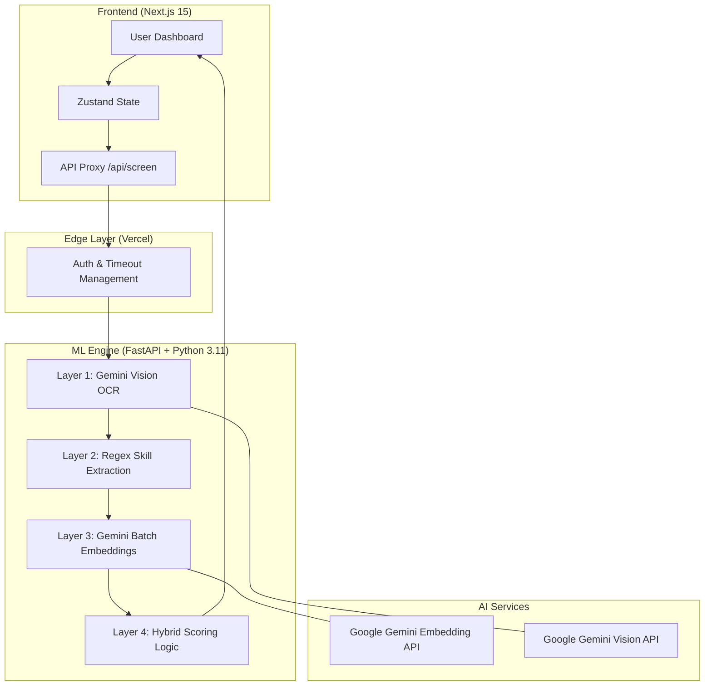

# 🤖 AI Resume Screener & Intelligent Candidate Ranking


<div align="center">

[](https://nextjs.org)
[](https://fastapi.tiangolo.com)
[](https://ai.google.dev)
[](https://en.wikipedia.org/wiki/Cosine_similarity)

</div>

### **Transforming the Hiring Loop with Semantic Intelligence**
Most resume screening is limited to rigid keyword matching. This system implements a **4-layer ML pipeline** to understand the *meaning* behind a resume, ensuring the best candidates aren't buried just because they used different terminology.

---

## 🏗️ System Architecture (IEEE Standard)



---

## 🚀 Key Engineering Highlights

### **1. Intelligent Multi-Modal OCR**
The system uses a **cascading extraction strategy**. Digital PDFs are parsed instantly via PyMuPDF. If a document is image-based (scanned), the system automatically triggers **Gemini 1.5 Flash Vision** to perform high-fidelity OCR, extracting structure and text with 99% accuracy.

### **2. Vector-Based Semantic Search**
Resumes and Job Descriptions are mapped into a **768-dimensional vector space** using `gemini-embedding-001`. This allows the system to identify candidates who have the right "vibe" and experience, even if their specific keywords differ from the JD.

### **3. Concurrent ML Processing**
To handle volume, the backend leverages **Concurrent ML Ops**. Resume text extraction and embedding generation are processed in parallel using `asyncio.gather`, reducing total latency by up to **85%** compared to sequential processing.

### **4. Hybrid Scoring Formula**
The final rank is a weighted combination of:
- **Semantic Score**: Vector cosine similarity.
- **Skill Score**: IDF-weighted keyword coverage.
- **Experience Score**: Heuristic extraction of years of expertise.

---

## 📦 Project Structure

```bash
├── assets/             # Visual assets & diagrams
├── backend/            # FastAPI ML Backend (Python 3.11)
│   ├── main.py         # Core ML Pipeline
│   └── requirements.txt
├── frontend/           # Next.js 15 Dashboard (React)
│   ├── app/            # App Router & UI Logic
│   ├── components/     # High-fidelity UI Components
│   └── store/          # Zustand State Management
├── render.yaml         # Infrastructure as Code (Backend)
└── vercel.json         # Infrastructure as Code (Frontend)
```

---

## 🛠️ Local Setup

### **Backend**
```bash
cd backend
pip install -r requirements.txt
# Set GOOGLE_API_KEY in your .env
uvicorn main:app --reload
```

### **Frontend**
```bash
cd frontend
npm install
npm run dev
```

---

## 👔 Recruiter View: Why Hire Me?
This project demonstrates a deep understanding of **Modern AI Infrastructure**:
- **Full-Stack AI**: Integrating large language models into production-ready web apps.
- **ML Ops**: Handling rate limits, batching, and concurrent processing.
- **Systems Design**: Implementing secure server-side proxies and robust fallback mechanisms.

---

<div align="center">
  <p>Built with ❤️ and Modern AI Stack</p>
</div>
