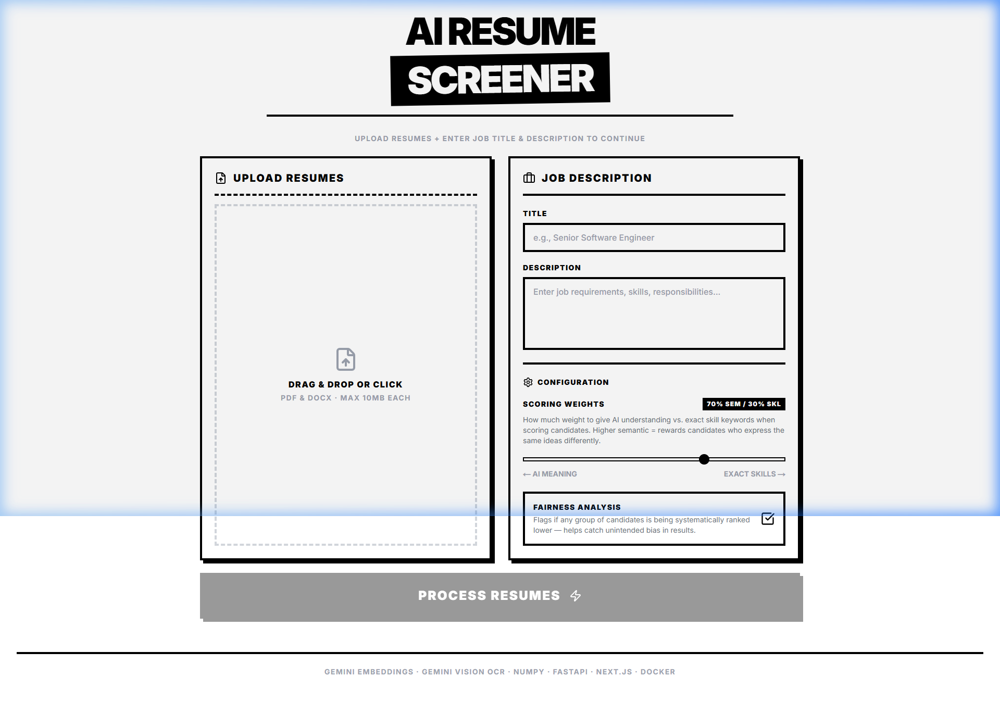
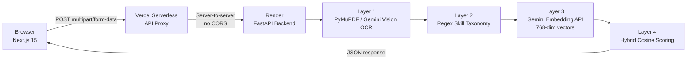

<div align="center">

# 🤖 AI Resume Screener

### Semantic resume screening powered by a 4-layer Gemini ML pipeline

[](https://ai-resume-screener-sepia.vercel.app)
[](https://github.com/kunal-gh/assignment/actions/workflows/ci.yml)

</div>

---



> Upload PDFs or DOCX resumes, paste a job description, and get AI-ranked candidates with semantic scores, skill analysis, matched keywords, and explanations — all in one request.

---

## 🏗️ Architecture



The frontend **never** calls the ML backend directly. All traffic is proxied through a Vercel serverless function, eliminating CORS issues for `multipart/form-data` uploads and keeping the Render backend URL private.

---

## 🔬 ML Pipeline — 4 Layers

| Layer | Technology | What it does |
|-------|-----------|--------------|
| **1 — Text Extraction** | PyMuPDF → Gemini 1.5 Flash Vision | Extracts text from digital PDFs instantly. Falls back to Vision OCR for scanned/image-based documents. |
| **2 — Skill Extraction** | Regex + IDF taxonomy (60+ skills) | Identifies canonical skills using an IDF-weighted lookup table. Short tokens use word-boundary matching to prevent false positives. |
| **3 — Embedding** | `gemini-embedding-001` (768-dim) | Encodes the JD as a `retrieval_query` vector and each resume as a `retrieval_document` vector in a single batched API call. Supports chunking for large batches (>50 docs). |
| **4 — Hybrid Scoring** | NumPy cosine similarity | `score = 0.7 × semantic_sim + 0.3 × idf_skill_score`. Detects "Hidden Gems" where semantic alignment is high but keyword overlap is low. |

---

## 🛠️ Tech Stack

### Frontend
| Tool | Role |
|------|------|
| **Next.js 15** (App Router) | Full-stack React framework, handles routing, SSR, and serverless API routes |
| **React 19** | UI component layer with concurrent rendering |
| **Zustand** | Lightweight state management for the screening pipeline state machine |
| **Framer Motion** | Smooth entrance animations, progress transitions, and micro-interactions |
| **Recharts** | Score breakdown bar charts and analytics visualisation |
| **react-dropzone** | Drag-and-drop PDF/DOCX upload with MIME validation |
| **Tailwind CSS** | Utility-first styling with dark-mode support |

### Backend
| Tool | Role |
|------|------|
| **FastAPI** | Async Python web framework with automatic OpenAPI docs |
| **PyMuPDF (fitz)** | Fast in-memory PDF text extraction from binary bytes |
| **python-docx** | DOCX text extraction via BytesIO |
| **google-genai** | Official Google Gen AI SDK for Gemini Vision OCR and batch embeddings |
| **NumPy** | Vector math for cosine similarity scoring |
| **asyncio.gather** | Concurrent OCR processing — all resumes extracted in parallel |

### Infrastructure
| Tool | Role |
|------|------|
| **Vercel** | Frontend hosting + Serverless API proxy (60s `maxDuration`) |
| **Render (Docker)** | ML backend container hosting on free tier |
| **GitHub Actions** | CI: Black formatting, Flake8 lint, Bandit security scan, TypeScript type check, Docker build |

---

## 📦 Repository Structure

```
├── assets/                      # Screenshots and diagrams
├── backend/                     # Python ML Backend
│   ├── Dockerfile
│   ├── main.py                  # 4-layer ML pipeline (700 lines)
│   └── requirements.txt
├── frontend/                    # Next.js 15 App
│   ├── app/
│   │   ├── api/screen/route.ts  # Vercel proxy → Render
│   │   ├── page.tsx             # Main screening UI
│   │   └── globals.css
│   ├── components/              # FileUpload, ResultsView, CandidateCard, etc.
│   ├── store/
│   │   └── screeningStore.ts    # Zustand pipeline state machine
│   └── package.json
├── render.yaml                  # Render IaC (Docker runtime, health check)
├── .github/workflows/ci.yml     # Full CI pipeline
└── README.md
```

---

## ⚙️ Scoring Formula

```
Hybrid Score = (semantic_weight × cosine_sim) + (1 − semantic_weight) × idf_skill_score

Where:
  cosine_sim      = dot(jd_vec, resume_vec) / (|jd_vec| × |resume_vec|)
  idf_skill_score = Σ IDF(matched_skill) / Σ IDF(all_jd_skills)
  semantic_weight = 0.7  (default, configurable)

Hidden Gem flag: triggered when (sem − skill_score) > 0.3 AND sem ≥ 0.55
```

---

<div align="center">

**[🚀 Try it live →](https://ai-resume-screener-sepia.vercel.app)**

</div>
